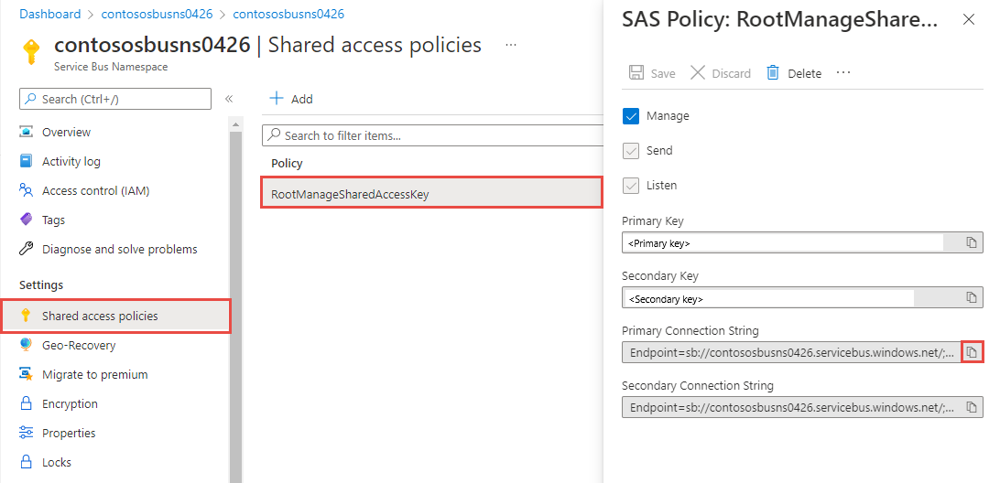

# Integration with Microsoft Azure Event Hubs using Cumulocity Notification 2.0 API

<div data-theme-toc="true"> </div>

# Introduction

IoT solutions have the potential to improve various aspects of your business, like generating new revenue streams, enhancing efficiency, and optimizing the overall user experience. However, the current challenge lies in tailoring an IoT solution precisely to your business needs. The combination of Microsoft Azure and Cumulocity blends the strengths of both, enabling you to gain an optimal IoT solution that matches with your specific requirements.

This article will guide you through the utilisation of the Cumulocity Notification 2.0 API and Azure Event Hubs to establish a connection between Microsoft Azure and Cumulocity IoT Platform. You will gain access to features from both platforms for your IoT solutions.

## Azure Event Hubs
[Azure Event Hubs](https://learn.microsoft.com/en-us/azure/event-hubs/event-hubs-about) is a cloud-based data streaming service that provide a unified event streaming platform with time retention buffer. It is designed to efficiently handle large volumes of data with low latency. Event producers and consumers operate independently, delivering and receiving events through a publish/subscribe model. By default, streaming data in Event Hubs is buffered for one hour. Multiple consumers can autonomously read the same streaming data at their own pace. 

Azure Event Hubs supports AMQP, Apache Kafka and HTTPs protocols natively. Specifically for AMQP 1.0 protocol, it offers [SDKs](https://learn.microsoft.com/en-us/python/api/overview/azure/eventhub-readme?view=azure-python&source=recommendations) in various language. With these client languages you can easily process your streaming data. 


This diagram illustrates the role of Event Hubs. It can establish a connection between data source and streaming analytics services on the Azure platform seamlessly. In our scenario, the event source is the streaming data from Cumulocity IoT Platform. You have the flexibility to add any services necessary for processing this data on Azure. 

## Cumulocity Notification 2.0 API

The Cumulocity Notification 2.0 API enables services to receive notifications generated through the utilization of both the REST and MQTT APIs. If you would to know more about how to use the Notification 2.0 API, please check out [this article](https://tech.forums.softwareag.com/t/step-by-step-instruction-for-cumulocity-notification-2-0/281764/) for a dive into the basics.

## Contents
After reading this article, you will know:
- How to create an Azure Event Hub
- How to receive C8Y notifications and transform them into a format acceptable by the Event Hubs 
- How to receive events from Event Hubs
- How to use the events in other Azure services 

Python will be used for this demonstration. You can also choose another programming language to build the Event Hubs client.


# Prerequirements


- C8Y:

  * A Cumulocity tenant with Messaging Service enabled
  * ADMIN permission for the permission type “Notification 2”
  * A device or simulator registered on the platform that generate alarms, events or managed objects

- Azure:

   - Microsoft Azure subscription
   - A resource group
   - Python 3.7 or later

Note: If you choose to use the AMQP protocol, make sure that there are no restrictions on ports 5671 and 5672 in your local network or firewall. 

# Create an Azure Event Hub


## Create a namespace

Namespace is a management container for Event Hubs topics. The management tasks like configuring network and streaming capacity are handled at namespace level. Before creating Event Hubs, you need to first define namespace in the resource group using Azure portal. For other methods please check out these [tutorials](https://learn.microsoft.com/en-us/azure/event-hubs/event-hubs-quickstart-cli). 

1. Select **Event Hubs** under the **Analytics** category in **All services** page. Select **Create** on the toolbar or click the **Create event hubs namespace** button 


2. Fill in the required fields in the **Basic** page. Select the **Pricing tier** based on your use case. **Throughput units** control the throughput capacity of Event hubs. A unit allows 1000 events per second for input and 4096 events per second for output. With enabled **Auto-Inflate** Event Hubs service can scale the throughput automatically. 


## Create an event hub
Once the namespace deployment is complete, click the **Go to resources** button to enter the namespace page. Here you can create your first event hub by clicking **+ Event Hub** on the command bar. Fill in the required fields. 

[Partitions](https://learn.microsoft.com/en-us/azure/event-hubs/event-hubs-features#partitions) are sequences of events in an event hub. When a new event comes into the event hub, it will be added at the end of a partition. Each event hub can have at least two or more partitions that specified at the time of creation of the event hub. For higher throughput more partitions are needed. 


Now your first event hub is ready to receive the first event from the client. 

# Receive notifications from C8Y and send events to Event Hub


You can create an Event Hub client in any [supported languages](https://learn.microsoft.com/en-us/azure/event-hubs/event-hubs-dotnet-standard-getstarted-send?tabs=passwordless%2Croles-azure-portal). Below is a python example based on the [tutorial](https://learn.microsoft.com/en-us/azure/event-hubs/event-hubs-python-get-started-send?tabs=passwordless%2Croles-azure-portal) provided in the Azure documentation. 

## Notification 2.0 consumer client
To access real-time data from your Cumulocity tenant, we'll create a consumer client with the Notification 2.0 API. Following standard API procedures, we initiate the client by creating a subscription and obtaining a token through REST API. Then we establish a WebSocket connection. To keep it simple, the subscription content is set to 'tenant,' and no filters are applied.

Create a subscription
``` 
subscription_json = {
    "context": "tenant",
    "subscription": C8Y_SUBSCRIPTION_NAME
}
response = client.post(
    C8Y_BASEURL + '/notification2/subscriptions',
    auth=C8Y_AUTH,
    headers=C8Y_HEADERS,
    data=json.dumps(subscription_json)
)
subscription_id = subscription_response['id']
``` 
Obtain a token
``` 
token_json = {
    'subscription': C8Y_SUBSCRIPTION_NAME,
    'subscriber': C8Y_SUBSCRIBER_NAME,
    'expiresInMinutes': C8Y_SUBSCRIPTION_EXPIRATION_MIN
}
response = client.post(
    C8Y_BASEURL + '/notification2/token',
    auth=C8Y_AUTH,
    headers=C8Y_HEADERS,
    data=json.dumps(token_json)
)
token = token_response['token']
``` 

Establish Websocket connection
``` 
ws_client = websocket.WebSocketApp(
    C8Y_BASEURL_WEBSOCKET + '/notification2/consumer/?token=' + token,
    on_open=open_handler,
    on_message=message_handler,
    on_error=error_handler,
    on_close=close_handler
)

ws_client.run_forever(sslopt={"cert_reqs": ssl.CERT_NONE}, ping_interval=60)
``` 

In the function `message_handler` the notifications will be split and sent to Azure Event Hubs.
A notification has two parts, header and content. They are separated by `\n\n`. A header has three lines of text separated by `\n`. Each line respectively contains the identity, the channel and the operation of the notification. The body is in JSON format. 
What's very handy is that Event Hubs supports events in JSON format. So, we just need to reformat the notification into an event in the JSON format in this function. 
For example:

``` 
def message_handler(ws, message):
    parts = message.split('\n\n')
    headers = parts[0].split('\n')
    body = parts[1]
    # Send acknowledgement
    ws.send(headers[0])

    body_json = json.loads(body)
    event_data_json = {
        'message': headers[0],
        'channel': headers[1],
        'action': headers[2]
    }
    event_data_json.update(body_json)
    event_data = json.dumps(event_data_json)
``` 

Then we can use Event Hub SDK to forward events to the Event Hub. You can find more details on the Notification 2.0 API in this [documentation](https://cumulocity.com/guides/reference/notifications/). 

## Event Hub Client using Python SDK (AMQP)
First the Python package for Event Hubs needs to be installed using this command: 
``` 
pip install azure-eventhub
``` 
To authenticate the app, the easiest way is to use connection string. It can be found in the **Shared access polices** page of the namespace. For production environment, [passwordless](https://learn.microsoft.com/en-us/azure/service-bus-messaging/service-bus-authentication-and-authorization) authentication is recommended. 


With the connection string, you can connect your client to the event hub and send events to it:
```
EVENT_HUB_CONNECTION_STR = "<<Connection String>>"
EVENT_HUB_NAME = "<<Name of Event Hub>>"

producer = EventHubProducerClient.from_connection_string(
    conn_str=EVENT_HUB_CONNECTION_STR, eventhub_name=EVENT_HUB_NAME, auth_timeout=180,
)

def send_event_data(message_data):
    with producer:
        event_data_batch = producer.create_batch()
        event_data = EventData(message_data)
        event_data_batch.add(event_data)
        producer.send_batch(event_data_batch)
        
```
Call this function within the function `message_handler` so that whenever there is a new notification, a new event will be created and published to Event Hubs. Here are some more [code samples](https://github.com/Azure/azure-sdk-for-python/tree/main/sdk/eventhub/azure-eventhub/samples) provided by Azure. 

Note: If you keep receiving errors during the create_batch step, there might be some network issues. Please try creating the client with HTTP protocol. 

## Event Hub Client using REST API
Events can also be published using Event Hubs REST API. SAS (shared access signature) key is required here for authorization. Here is an example in python to generate a SAS token: 
```
import time
import urllib
import hmac
import hashlib
import base64

def get_auth_token(sb_name, sas_name, sas_value):
    uri = urllib.parse.quote_plus("https://{}.servicebus.windows.net/".format(sb_name))
    sas = sas_value.encode('utf-8')
    expiry = str(int(time.time() + 10000))
    string_to_sign = (uri + '\n' + expiry).encode('utf-8')
    signed_hmac_sha256 = hmac.HMAC(sas, string_to_sign, hashlib.sha256)
    signature = urllib.parse.quote(base64.b64encode(signed_hmac_sha256.digest()))
    return  {"sb_name": sb_name,
             "token":'SharedAccessSignature sr={}&sig={}&se={}&skn={}' .format(uri, signature, expiry, sas_name)
            }
            
get_auth_token('<<Event Hub name>>','<<shared access policy>>', '<<Primary key>>')
```

You can find the policy name and primary key in the **Shared access policies** page. For other ways to generate SAS token, please check out the Azure [documentation](https://learn.microsoft.com/en-us/rest/api/eventhub/generate-sas-token). With this token in request's header, you can send the event via HTTP POST request.

```
POST https://{servicebusNamespace}.servicebus.windows.net/{eventHubPath}/messages
```


For more details on the Event Hubs REST API, please read Azure's [documentation](https://learn.microsoft.com/en-us/rest/api/eventhub/).

# Receive events from Event Hub


## Using Event Hubs Python SDK
Similar to events producer client, the events consumer client of Event Hubs also needs the connection string and the name of the Event hub to establish the connection. In addition to these, the consumer group needs to be specified. By default, the group name is `$Default`. Here is a simple example for consumer client: 

```
CONNECTION_STR = "<<Connection String>>"
EVENTHUB_NAME = "<<Name of Event Hub>>"

consumer_client = EventHubConsumerClient.from_connection_string(
    conn_str=CONNECTION_STR,
    consumer_group='$Default',
    eventhub_name=EVENTHUB_NAME,
)

def on_event(partition_context, event):
    # Put your code here.
    print(event)
    print("Received event from partition: {}.".format(partition_context.partition_id))
    
    
with consumer_client:
    consumer_client.receive(
        on_event=on_event,
        on_partition_initialize=on_partition_initialize,
        on_partition_close=on_partition_close,
        on_error=on_error,
        starting_position="-1",  # "-1" is from the beginning of the partition.
    )
```
Inside the `on_event` function, you can put some code for processing the received events. After the producer runs successfully, the consumer will be able to receive events. 

A simple consumer like this will retrieve all the events currently stored in Event Hubs each time it reruns. Additionally, you can use Azure Blob Storage to save checkpoints, which represent the last read position. This ensures that the next reading session won't duplicate the events already retrieved before. This is an example of optimizing the consumer client. You can find more consumer client code samples [here](https://github.com/Azure/azure-sdk-for-python/tree/main/sdk/eventhub/azure-eventhub/samples).

## Using Azure Stream Analytics Jobs (No-code editor)
Stream Analytics jobs is a stream processing engine on Azure. It can connect to Event Hubs for streaming data ingestion. Its No-code editor offers trag-and-drop functionalities to deploy stream analytics jobs. It can also output data to many storage systems or services, like Azure Data Lake Store and Power BI. 

In the Event Hubs instance page under the **Feature** section, go to **Process Data** and select **Start with a blank canvas**. Give your job a name, then click create. After successful creation, it will bring you to the no-code editor automatically. All required Event Hub information will also be added automatically. All you need to do is click **Connect**. Created jobs can be viewed and managed in the Stream Analytics jobs list. 

After the connection click on the Event Hub block, you will be able to view all the current event keys on the right hand side. At the bottom of the page, buffered events in the Event Hub will be displayed. Processed data can be exported to other Azure services, as shown in the following picture. 


Now you can customise your analytics job to fit your use case. For more information, please check out the [documentation](https://learn.microsoft.com/en-us/azure/stream-analytics/) of Stream Analytics Job.

# Useful links 

https://www.softwareag.com/en_corporate/resources/iot/wp/iot-solutions.html
https://learn.microsoft.com/en-us/azure/event-hubs/
https://tech.forums.softwareag.com/t/step-by-step-instruction-for-cumulocity-notification-2-0/281764/